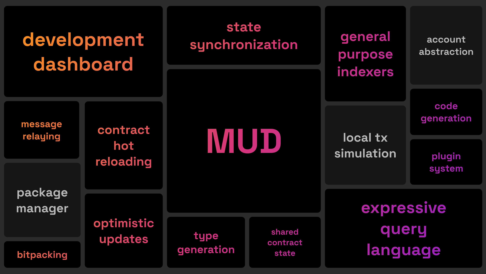

# MUD

<div align="center">

<p>Battle-tested onchain framework for developers</p>
</div>

<p align="center">
  <a aria-label="license MIT" href="https://opensource.org/licenses/MIT">
    
  </a>
  &nbsp;
  <a aria-label="test status" href="https://github.com/latticexyz/mud/actions/workflows/test.yml">
    
  </a>
  &nbsp;
  <a aria-label="docs status" href="https://github.com/latticexyz/mud/actions/workflows/docs.yml">
    
  </a>
</p>

MUD is a framework for ambitious Ethereum applications. It compresses the complexity of building EVM apps with a tightly integrated software stack.

MUD is MIT-licensed, open source and free to use.

## Features

<!--

-->

See [the development status page](https://status.mud.dev/).

## Quickstart

```
pnpm create mud@next my-project
```

For more information on how to get started, have a look at the [MUD documentation](https://mud.dev/quick-start).

## Talks

<div>
  <a href="https://www.youtube.com/watch?v=UvIWmzscWp8" target="_blank"></a>
  <a href="https://www.youtube.com/watch?v=j-_Zf8o5Wlo" target="_blank"></a>
  <a href="https://www.youtube.com/watch?v=mv3jA4USZtg" target="_blank"></a>
</div>

## Packages

MUD consists of several libraries. They can be used independently, but are best used together.

| Package                                                                                                           | Version                                                                                                                     |
| ----------------------------------------------------------------------------------------------------------------- | --------------------------------------------------------------------------------------------------------------------------- |
| **[@latticexyz/recs](/packages/recs)** <br />TypeScript Reactive Entity Component System library                  | [](https://www.npmjs.org/package/@latticexyz/recs)         |
| **[@latticexyz/services](/packages/services)** <br />Go services for indexer, faucet, message relay               | [](https://www.npmjs.org/package/@latticexyz/services) |
| **[@latticexyz/cli](/packages/cli)** <br />Command line interface for types, testing, faucet, deployment and more | [](https://www.npmjs.org/package/@latticexyz/cli)           |
| **[@latticexyz/noise](/packages/noise)** <br />Solidity and AssemblyScript implementations of Perlin noise        | [](https://www.npmjs.org/package/@latticexyz/noise)       |

## Contribute

We'd love your support in improving MUD! This monorepo includes all of MUD's source code, and pull requests are always welcome. To discuss new features or changes [join our Discord](https://lattice.xyz/discord).

### Local development setup

!!!
The following steps are only necessary if you want to contribute to MUD. To use MUD in your project, install the [packages](#packages) from npm or [set up a new project with the MUD cli](#quickstart).
!!!

1. Install the foundry toolkit (required to build and test MUD solidity packages): [https://getfoundry.sh/](https://getfoundry.sh/)

2. Install pnpm

   ```
   npm install pnpm --global
   ```

3. Clone the MUD monorepo

   ```
   git clone https://github.com/latticexyz/mud
   ```

4. Install MUD dependencies and setup local environment

   ```
   cd mud && pnpm install && pnpm build
   ```

### Pull requests

MUD follows the [conventional commit specification](https://www.conventionalcommits.org/en/v1.0.0/) for commit messages and PR titles. Please keep the scope of your PR small (rather open multiple small PRs than one huge PR) and follow the conventional commit spec.

## Community support

[Join our Discord](https://lattice.xyz/discord) to get support and connect with the community!

## License

MUD is open-source software [licensed as MIT](LICENSE).
