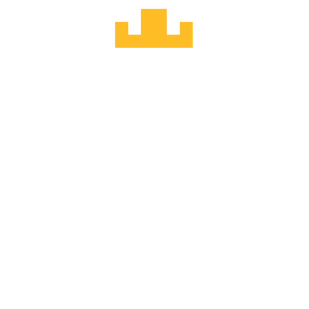
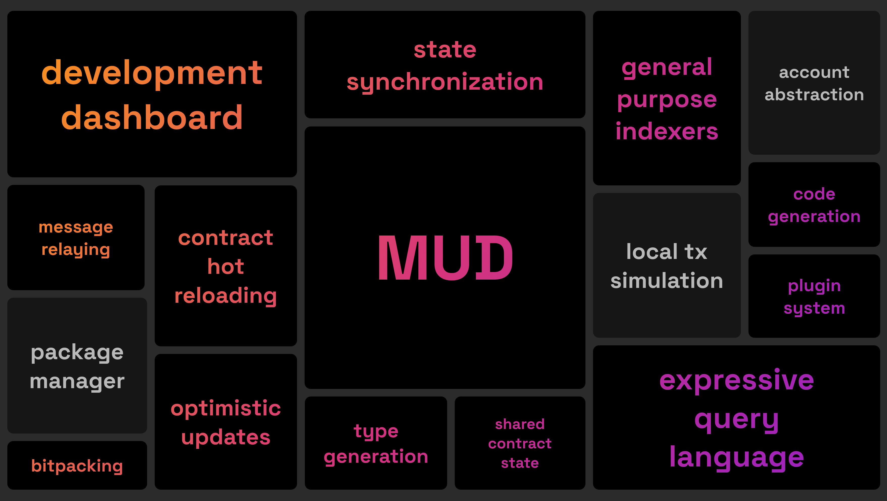
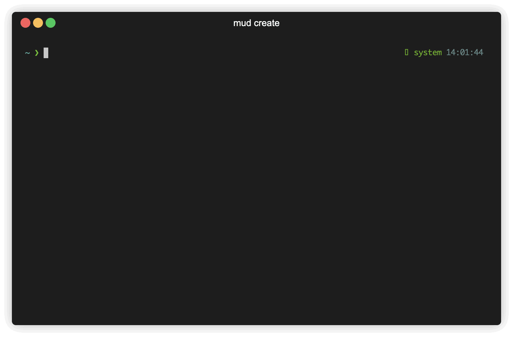

# MUD

<div align="center">

<p>MUD - Engine for Autonomous Worlds</p>
</div>

<p align="center">
  <a aria-label="license MIT" href="https://opensource.org/licenses/MIT">
    
  </a>
  &nbsp;
  <a aria-label="test status" href="https://github.com/latticexyz/mud/actions/workflows/test.yml">
    
  </a>
  &nbsp;
  <a aria-label="docs status" href="https://github.com/latticexyz/mud/actions/workflows/docs.yml">
    
  </a>
</p>

MUD is a framework for complex Ethereum applications.

It adds some conventions for organizing data and logic and abstracts away low-level complexities so you can focus on the features of your app.

It standardizes the way data is stored on-chain.
With this standard data model, MUD can provide all network code to synchronize contract and client state. This includes synchronizing state directly from an RPC node or a general-purpose MUD indexer.

MUD is MIT-licensed, open source and free to use.

## Features



### Today

- State synchronization between contracts and clients without custom networking code
- General purpose indexers (without custom indexing code)
- Seamless contract upgrades (+ automatic contract upgrades during development)
- Shared contract state
- Optimistic updates
- Automatic type generation for contracts and systems
- Query language to interact with contract state
- Data explorer to inspect and modify contract and local state
- Bitpacking utilities

### Soon

- Local simulation of transactions (including optimistic state)
- Built-in support for account abstraction
- Contract package manager

## Quickstart

```
pnpm create mud my-project
```



## Packages

MUD consists of several libraries. They can be used independently, but are best used together.

| Package                                                                                                                   | Version                                                                                                                               |
| ------------------------------------------------------------------------------------------------------------------------- | ------------------------------------------------------------------------------------------------------------------------------------- |
| **[@latticexyz/solecs](/packages/solecs)** <br />Solidity Entity Component System library                                 | [](https://www.npmjs.org/package/@latticexyz/solecs)               |
| **[@latticexyz/network](/packages/network)** <br />TypeScript networking library for automatic contract/client state sync | [](https://www.npmjs.org/package/@latticexyz/network)             |
| **[@latticexyz/recs](/packages/recs)** <br />TypeScript Reactive Entity Component System library                          | [](https://www.npmjs.org/package/@latticexyz/recs)                   |
| **[@latticexyz/services](/packages/services)** <br />Go services for indexer, faucet, message relay                       | [](https://www.npmjs.org/package/@latticexyz/services)           |
| **[@latticexyz/cli](/packages/cli)** <br />Command line interface for types, testing, faucet, deployment and more         | [](https://www.npmjs.org/package/@latticexyz/cli)                     |
| **[@latticexyz/std-contracts](/packages/std-contracts)** <br />Solidity standard library                                  | [](https://www.npmjs.org/package/@latticexyz/std-contracts) |
| **[@latticexyz/std-client](/packages/std-client)** <br />Typescript standard library                                      | [](https://www.npmjs.org/package/@latticexyz/std-client)       |
| **[@latticexyz/noise](/packages/noise)** <br />Solidity and AssemblyScript implementations of Perlin noise                | [](https://www.npmjs.org/package/@latticexyz/noise)                 |

## Contribute

We'd love your support in improving MUD! This monorepo includes all of MUD's source code, and pull requests are always welcome. To discuss new features or changes [join our Discord](https://lattice.xyz/discord).

### Local development setup

!!!
The following steps are only necessary if you want to contribute to MUD. To use MUD in your project, install the [packages](#packages) from npm or [set up a new project with the MUD cli](#quickstart).
!!!

1. Install go (required to build [packages/services](packages/services/)): [https://go.dev/doc/install](https://go.dev/doc/install)

2. Install the foundry toolkit (required to build and test MUD solidity packages): [https://getfoundry.sh/](https://getfoundry.sh/)

3. Install pnpm

```bash
npm install pnpm --global
```

4. Clone the MUD monorepo

```
git clone https://github.com/latticexyz/mud
```

5. Install MUD dependencies

```
cd mud && pnpm install
```

6. Setup the local environment

```
pnpm build
```

### Pull requests

MUD follows the [conventional commit specification](https://www.conventionalcommits.org/en/v1.0.0/) for commit messages and PR titles. Please keep the scope of your PR small (rather open multiple small PRs than one huge PR) and follow the conventional commit spec.

## Library

[!embed](https://www.youtube.com/embed/j-_Zf8o5Wlo)
[!embed](https://www.youtube.com/embed/mv3jA4USZtg)

## Community support

[Join our Discord](https://lattice.xyz/discord) to get support and connect with the community!

## License

MUD is open-source software [licensed as MIT](LICENSE).
