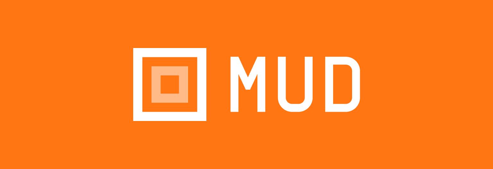

# MUD

<div align="center">



<div  style="margin: 0 0 30px 0;"></div>
<p>Battle-tested onchain framework for developers</p>
</div>

<p align="center">
  <a aria-label="license MIT" href="https://opensource.org/licenses/MIT">
    
  </a>
  &nbsp;
  <a aria-label="test status" href="https://github.com/latticexyz/mud/actions/workflows/test.yml">
    
  </a>
  &nbsp;
  <a aria-label="docs status" href="https://github.com/latticexyz/mud/actions/workflows/docs.yml">
    
  </a>
</p>

MUD is a framework for ambitious Ethereum applications.

It offers a composable foundation to EVM developers that handles data storage, upgrades, delegations, data-sync with frontends, etc.
You can learn more about MUD in the [MUD documentation](https://mud.dev/introduction)

## Quickstart

```
pnpm create mud@latest
```

Then follow the directions onscreen.

For more information on how to get started, have a look at the [MUD quickstart](https://mud.dev/quickstart).

## Contribute

We'd love your support in improving MUD, [see here for instructions](https://mud.dev/contribute).
This monorepo includes all of MUD's source code, and pull requests are always welcome.
To discuss new features or changes [join our Discord](https://lattice.xyz/discord).

## Community support

[Join our Discord](https://lattice.xyz/discord) to get support and connect with the community!

## License

MUD is open-source software [under the MIT license](LICENSE).
