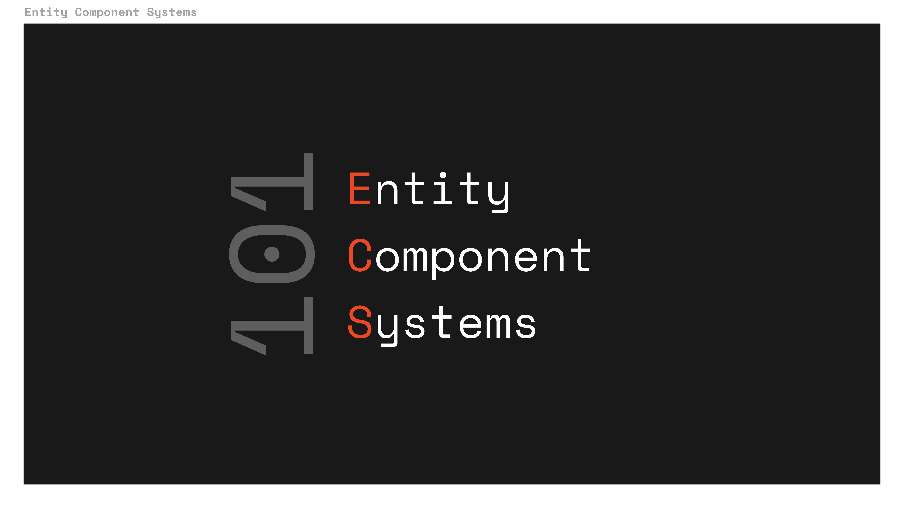
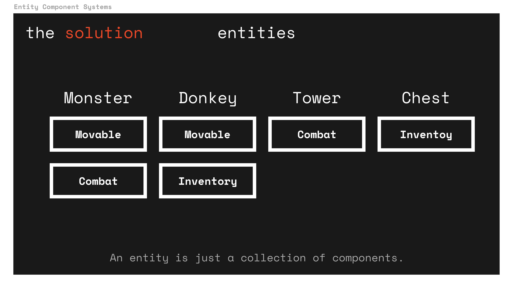

# Introduction to the Entity Component System (ECS) pattern

This document outlines the basics of the ECS pattern (or the ECS variant we use in MUD).
It is recommended to first read this introduction to create some general intuition for ECS before diving into more specific documentation of the MUD packages.



## Motivation

The ECS pattern is an alternative to other popular software architecture paradigms like class based inheritance.
Let's start with a simple example to illustrate why ECS is cool.

Imagine we're building a game with two types of entities: Monsters and Donkeys.
Both Monsters and Donkeys can move.
In a world with classes and inheritance we could create a `Movable` base class and let both your `Monster` and `Donkey` class inherit from this base class.
So far so good.

Now imagine we want to add combat to your game.
Monsters participate in combat, Donkeys don't.
So we put the combat logic in your `Monster` class.
Still fine.

But now imagine we want to add Towers.
Towers participate in combat, but can't move.
A `Combat` base class that both `Monster` and `Tower` inherit from would be nice, but `Monster` already inherits from `Movable` and multi-inheritance [can get messy very quickly](https://en.wikipedia.org/wiki/Multiple_inheritance#The_diamond_problem).
"Singletons" and "Managers" are another approach to solve this problem, [but don't scale very well and easily end in unmaintainable code](https://gameprogrammingpatterns.com/singleton.html) (believe me, we've been there).
We're already running into architecture problems with three types of entities and two "functionalities".
Imagine the mess if next we'd want to add Chests with inventories and also retrofit Donkeys with inventories.
Unbearable.

Let's see how ECS can solve this problem.
In ECS we have three fundamental building blocks: Entities, Components and Systems.
Entities are just IDs and don't contain any logic or data.
Components contain data and can be "attached to entities".
They can be thought of as "properties", but the data is structured in a different way from class properties - more details below.
Systems implement the logic and only care about components, not about entities.

To solve our problem, we can create three components: `Movable`, `Combat`, and `Inventory`.
Next we add three systems to implement the logic.
The `MovementSystem` handles movement of any entity with the `Movable` component. The `CombatSystem` and `InventorySystem` handle movement and inventory of any entity with the `Combat` or `Inventory` component respectively.

Now implementing our entities is trivial:

- `Monster`: [`Movable`, `Combat`]
- `Donkey`: [`Movable`, `Inventory`]
- `Tower`: [`Combat`]
- `Chest`: [`Inventory`]



And we even get the option to add more types of entities for free:

- `Scout`: [`Movable`]
- `Warchest`: [`Combat`, `Inventory`]
- `Hero`: [`Movable`, `Combat`, `Inventory`]

Note how every component we add exponentially increases the number of entity types we can create (Number of possible combinations of `n` components = 2<sup>`n`</sup>).

And since each system only cares about a limited set of components, our logic is highly decoupled and very extendable.

With this simple example in mind, let's have a look at some more details.

## Entities and Components

Entities are represented as simple IDs that neither contain data nor logic.
Components contain data associated with entities.

Conceptually we speak of components being attached to entities, but technically components are key-value stores with entity ids as keys and their corresponding component values as values.

Example: a `Position` component contains the position data for each entity that has a position.
The implementation may vary, but in its simplest form the `Position` component is a key value store that may look like this:

```typescript
{
  entity1: { x: 1, y: 2},
  entity2: { x: 2, y: 3}
  entity3: { x: 1, y: 2}
}
```

This architecture has advantages for memory management and composability.
Since each system only cares about a small set of components, it only needs to load those components and has all the data it needs ready.
And since all data of a component is encapsulated inside the component, adding new components can not interfere with existing data or logic.

## Systems

Systems implement logic.
They do not care about they "type" of entity they act on, only about a small set of components.
Depending on the implementation, systems can run in a game loop (eg 60 times per second), reactively when the components they care about change or only when being called manually.

## Further reading

- [This article from Game Programming Patterns provides some more intuition on the ECS pattern.](https://gameprogrammingpatterns.com/component.html) Note that the pattern described in the articles has some subtle differences to the pattern used in MUD, but the basic principles are the same
- MUD recs documentation (reactive ECS library in TypeScript)
- MUD solecs documentation (solidity ECS library)
