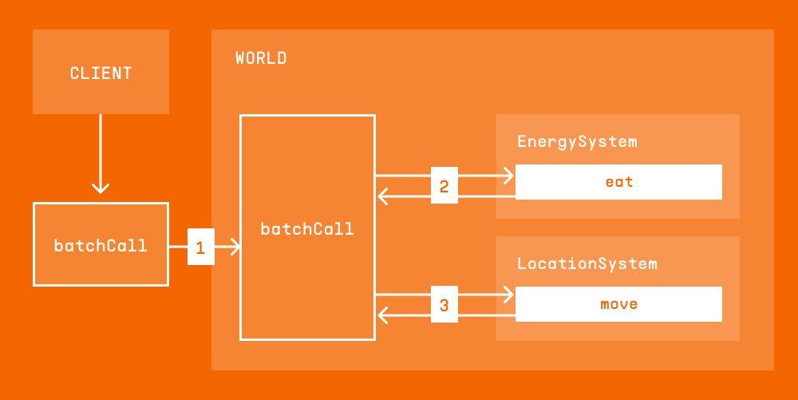
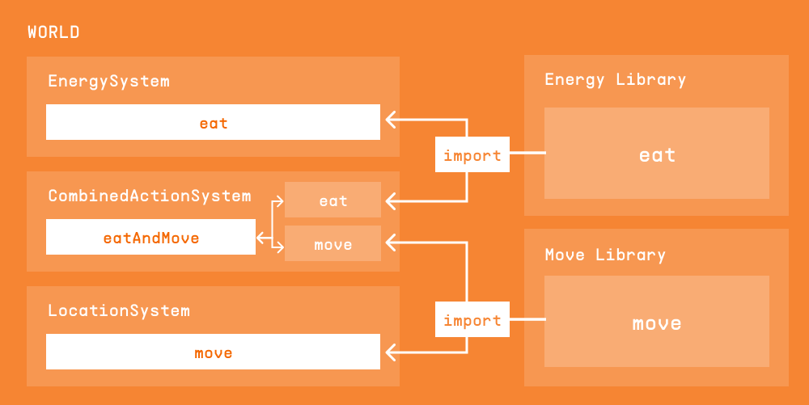
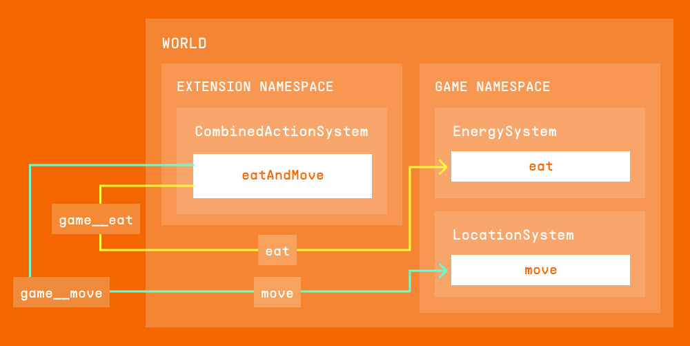
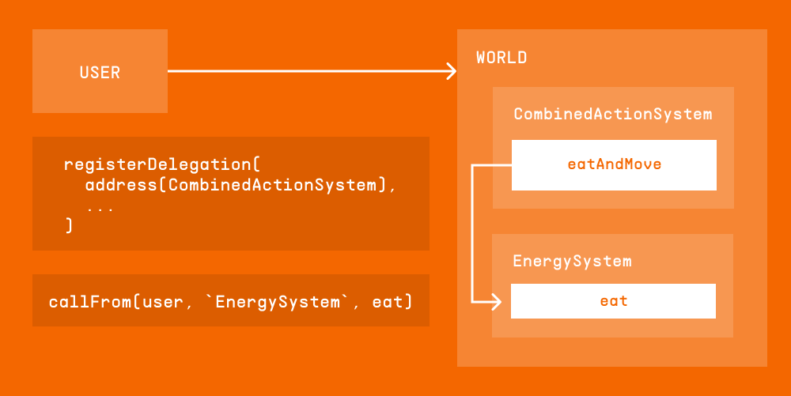

import { Callout } from "nextra/components";

# Dividing Code into `System`s

This page discusses situations in which either you need to divide your code into multiple `System`s, or it seems like that would be a good solution.

## Good reasons

There are several reasons to divide the code in a namespace into multiple `System`s.

### Modularity

It is easier to write and maintain code that is [modular](https://en.wikipedia.org/wiki/Modularity).
If two parts are logically distinct, with a limited interface between them, it might make sense to create them as two different `System`s.
Such a division can simplify QA and upgrades.

### Access control considerations

Each `System` is either publicly accessible (can be called by anybody) or accessible only from authorized addresses.
These addresses can be:

- [Externally owned accounts](https://ethereum.org/en/developers/docs/accounts/#types-of-account)
- Contracts outside of the `World`
- `System`s that are _not_ in the root namespace.
  [Root namespace `System`s](/world/systems#root-systems) _can_ [call other `System`s](/world/systems#calling-from-a-root-system), but they can also bypass access control.

If access to some functions needs to be restricted to specific addresses, those functions belong in a separate `System` from the rest of the namespace.

<Callout type="warning" emoji="⚠️">
  Access to a private `System` in a namespace is [granted to the namespace owner, as well as all `System`s within that
  namespace](/world/namespaces-access-control#modifying-access-control). If you need to disallow access from a separate
  `System`, put the private `System` in a different namespace.
</Callout>

Another consideration is that code should be given only those permissions necessary to perform its tasks ([the Principle of Least Privilege](https://en.wikipedia.org/wiki/Principle_of_least_privilege)).
If only some of the functions of a `System` need to have certain privileges, it might make sense to put those functions in a separate `System`.

#### Access to the root namespace

This is a particularly extreme example of least privilege.
The root namespace is [extremely privileged](/guides/best-practices/system-best-practices#avoid-the-root-namespace-if-possible).
So the code that has to run the root namespace should be a separate `System` from the code that can be in a different namespace.

## Bad reasons

There are problems that could be solved by dividing your logic into multiple `System`s, but that are better handled by other solutions.

### Shared logic

If some logic is shared between two different `System`s, it is tempting to write a third `System` that implements it and call it from both of them.
However, a simpler solution is to use a [Solidity library](https://solidity-by-example.org/library/) to implement the shared logic.

### Contract size limit

Ethereum contracts are limited in size, but you can always use [a public library](/guides/best-practices/system-best-practices#use-libraries-to-bypass-the-contract-size-limit) to work around that limit.

## Calling multiple `System`s

It is pretty common to already have two different `System`s, and then need to call them together.
For example, imagine you have a `System` that manages the player's position, called `LocationSystem`.
The player can call a `move` function.
Then you have another `System`, `EnergySystem`.
The player can call an `eat` function.
Now you want a combined action, `eatAndMove`.

There are multiple ways to create this combined action, only some of which require the extra complication of a third `System`.

### Use batch calls (from the client)

Under these conditions:

- You want `eat` and `move` to happen in sequence.
- You want them to happen atomically (so you can't just call `eat` and then `move`).
- You have no additional logic that needs to happen between them.

You can achieve this by using [batch calls](/world/batch-calls), without any need for changes in the `World`.

Illustration

1. The client sends a [`batchCall`](/world/batch-calls) that includes call to `eat` and `move`.
1. The `batchCall` component inside the `World` calls the first function, `eat`.
1. After the `eat` function returns, the `batchCall` component calls `move`.

### Move code into libraries

Under these conditions:

- You control the namespace of `LocationSystem` and `EnergySystem`.
- The permissions required for `move` and `eat` are the same.

You can move the code for `move` and `eat` into [public libraries](/guides/best-practices/system-best-practices#use-libraries-to-bypass-the-contract-size-limit).
These libraries can then be called from `LocationSystem`, `EnergySystem`, and `CombinedActionSystem`.

  
Illustration

  

### More complicated solutions

The above solutions are preferable, but sometimes they don't work.
For example, if you need to ensure some code runs between `eat` and `move`, you can't have the client use `batchCall`.
If you are writing an extension to a game written by somebody else, you don't have control of the namespaces of the `System`s, so you can't just move code into public libraries.

#### No trusted context

Any call that a `System` receives from the `World` has [some context information](/world/systems#writing-systems): the identity of the caller and the ETH value transferred by the call.
If `eat` and `move` don't rely on this context information you can create a third `System` that called the `World` for `eat` and `move`, [just as an unrelated contract would](/world/systems#calling-systems).
The caller identity will be the address of that `System`, and the value transferred will be zero regardless of the original value, but this is OK for some applications.

Illustration

`CombinedActionSystem` first calls the `World` with the function call `game__eat`.
This call is translated by the `World` to `eat` in `EnergySystem`, located in the `game` namespace.
This flow is shown in yellow.

Then, `CombinedActionSystem` calls the `World` with the function call `game__move`.
This call is translated by the `World` to `move` in `LocationSystem`, which is also located in the `game` namespace.
This flow is shown in green.

<Callout type="info" emoji="⚠️">
  This applies only to a case where the third `System` is *not* in the root namespace. If the root namespace is
  necessary, [see below](#when-root-namespace-is-unavoidable).
</Callout>

#### Calling with the caller's identity

If the functions require the identity of the message sender, you can still call them from a separate `System` (as long as it is _not_ running in the root namespace) using [delegation](/world/account-delegation#user-delegation).
Non-root `System`s have their own addresses, so you can ask users to [call `registerDelegation`](/world/account-delegation#creating-a-user-delegation) to allow your `System` to act on their behalf, and then your system can [use `callFrom`](/world/account-delegation#using-a-user-delegation) to send the user's identity when calling `eat` and `move`.

Note that this _only_ works for `_msgSender()` (the MUD version of `msg.sender`).
It does not let you propagate the value for `_msgValue()` (the MUD version of `msg.value`).

  
Illustration

  

#### When root namespace is unavoidable

There are a few cases that require `System` functions to be called from the root namespace.

- The called `System` needs to know the value sent with the transaction to the caller `System`.
- You cannot use `callFrom` because users won't sign `registerDelegation`.
- The code that the calling `System` has to implement needs to be in the root namespace for some other reason (for example, to modify root tables).

In those cases, you can use [`SystemCall`](/world/systems#calling-from-a-root-system) if the message sender is authorized to call the `System` directly.
If the message sender is not normally authorized you can use [`WorldContextProviderLib.callWithContext`](https://github.com/latticexyz/mud/blob/main/packages/world/src/WorldContext.sol#L122-L140), a low level function that bypasses access controls.
