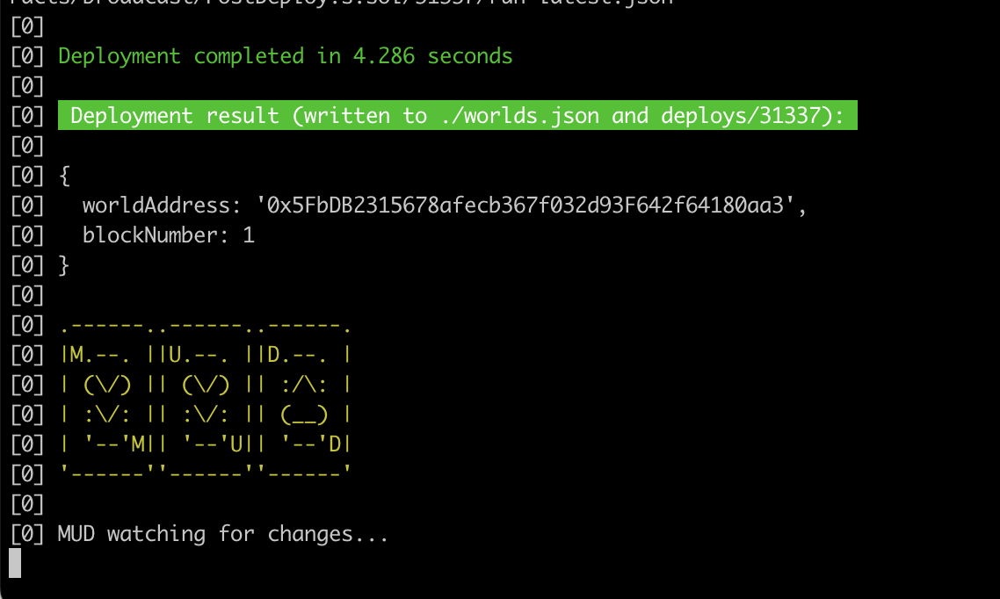
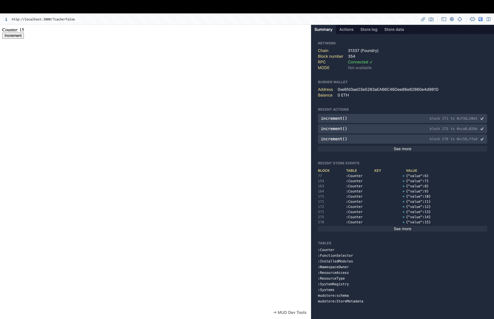

# Getting started

_If you haven’t already, check out the [Introduction](/#introduction) to learn more about MUD before beginning._

In this tutorial you will create your first MUD project and gain an understanding of its structure. We will also explore MUD’s built in dev tools.

Before we begin let’s make sure your local environment is setup with the proper prerequisites.

## Prerequisites

1. git ([download](https://git-scm.com/downloads))
2. foundry (forge, anvil, cast) ([download](https://book.getfoundry.sh/getting-started/installation), make sure to `foundryup` at least once)
3. node.js (v16+) ([download](https://nodejs.org/en/download/))
4. pnpm (after installing node: `npm install --global pnpm`)

If you are using Windows:

**Windows steps**

1. install git bash (gitforwindows.org)
2. install `nodejs`, including “native modules” (nodejs.org/en/download) (re native modules: just keep the checkmark, it’s enabled by default in the installer)
3. Install foundry via foundryup using Git bash

## Project setup

To start off let’s create your MUD project from a template by running the following pnpm command.

```bash
pnpm create mud@canary my-project
```

At this point you will see the option of choosing a template—as of writing the three options are **vanilla**, **react** and **phaser**. For the sake of this tutorial any of them works, but examples from the **vanilla** template will be used here.

After selecting your template you can run the app by switching into the project directory (`cd my-project`) and starting the development server.

```bash
pnpm run dev
```

If all went well you should see this in your command line.



After deployment is successful, pop over to [http://localhost:3000](http://localhost:3000) and checkout your live app. When you visit you’ll see an increment button and dev tools open in the right-hand panel. Try clicking the button and seeing what updates in the dev tools!

If you want to open or close the dev tools at any time, you can press the ` key on your keyboard or the button on the bottom right.



## Structure overview

The basic structure of the MUD template is broken down into two main sections: `packages/contracts` and `packages/client`.

- **The contracts package** contains the MUD config, table definitions, systems, and a PostDeploy script. If you don’t know what any of this is, don’t worry—we’ll explain this all in detail in the [Contracts](#contracts-package) section.
- **The client package** includes an `index.ts` (or `index.tsx` depending on template) file and a lot of MUD boilerplate code that will bootstrap MUD, network sync, and more. Most of this code (in `src/mud`) can be ignored but we will cover a few key ones to look out for in the [Client](#client-package) section.

Let’s continue by covering `packages/contracts` in more detail.

## Contracts package

This package contains everything MUD needs to connect your tables and systems to the client and the chain you’re deployed on.

There are a few key files we will be going over:

- `mud.config.ts` defines then auto-generates tables in `src/codegen/tables`.
- `src/systems` is where all logic you write for your application will live, we’ll explore this via the default `IncrementSystem.sol`
- `PostDeploy.s.sol` which populates tables with initial data if necessary. This could be useful to build a game with a predefined map, like in [Emojimon](./emojimon), for example.

Let’s dive into `mud.config.ts` in more detail.

### MUD config

The MUD config (`mud.config.ts`) is where you define all [tables](/store/config#adding-tables) for your application; tables make up the [MUD Store](/store) and contain value columns and key columns.

In your template the config starts with a single table: `Counter`.

```tsx
import { mudConfig } from "@latticexyz/world/register";

export default mudConfig({
  tables: {
    Counter: {
      keySchema: {},
      schema: "uint32",
    },
  },
});
```

Counter is a table with a single column of the type `uint32`, but this could have been assigned to any valid Solidity type.

This particular table is operated on by `IncrementSystem.sol` which we will discuss shortly.

If you want to learn more about how to setup tables and interface with the MUD config, you can jump to [this section](/store/config) of the docs.

### Systems

MUD was built with a complete separation of **data** (via tables and the Store) and **logic** (via stateless contracts with custom permissions). These stateless pieces of logic are what we call the **systems** of MUD.

In the previous section we discussed the default `Counter` table. Now we will discuss how the default `IncrementSystem.sol` operates on that table.

```tsx
// SPDX-License-Identifier: MIT
pragma solidity >=0.8.0;

import { System } from "@latticexyz/world/src/System.sol";
// make sure to import the auto-generated table(s) needed
import { Counter } from "../codegen/Tables.sol";

contract IncrementSystem is System {
  function increment() public returns (uint32) {
    uint32 counter = Counter.get();
    uint32 newValue = counter + 1;
    Counter.set(newValue);
    return newValue;
  }
}
```

The increment system is able to import `Counter` (from its autogenerated table schema) and operate on it by increasing its value by one.

Each system can contain any number of methods, though this sytem only has the single method—`increment`.These methods can then be called in the client to execute them in a transaction.

## Client package

The client package will vary depending on which template used (vanilla, react or phaser), but much of it will remain the same between the two. Vite is used for bundling and serving the client app. As mentioned earlier there is boilerplate code included in each to bootstrap MUD. There are a few files you should understand and be aware of as you build your project:

- `contractComponents.ts` has RECS component definitions created for you; this file will automatically regenerate as you add tables and re-run `pnpm dev`.
- You can adjust `clientComponents.ts` to either override contract components or add client-only components.
- If you are using chains other than foundry/anvil and lattice testnet, you can add them in `getNetworkConfig.ts`
- `createSystemCalls` represents how the client talks to the system contracts via our `worldSend` helper
- `setup.ts`

Beyond these files you can concern yourself simply with building out the frontend of the client.

## Calling systems from the client

Now that you’re familiar with the basic structure of the client package, let’s go over how you can call on systems from the contracts package.

The starter project comes with `IncrementSystem.sol`—you can see it being called in `index.ts` (or `index.tsx` in the react template).

```tsx
// Just for demonstration purposes: we create a global function that can be
// called to invoke the Increment system contract via the world. (See IncrementSystem.sol.)
(window as any).increment = async () => {
  const tx = await worldSend("increment", []);

  console.log("increment tx", tx);
  console.log("increment result", await tx.wait());
};

mountDevTools();
```
