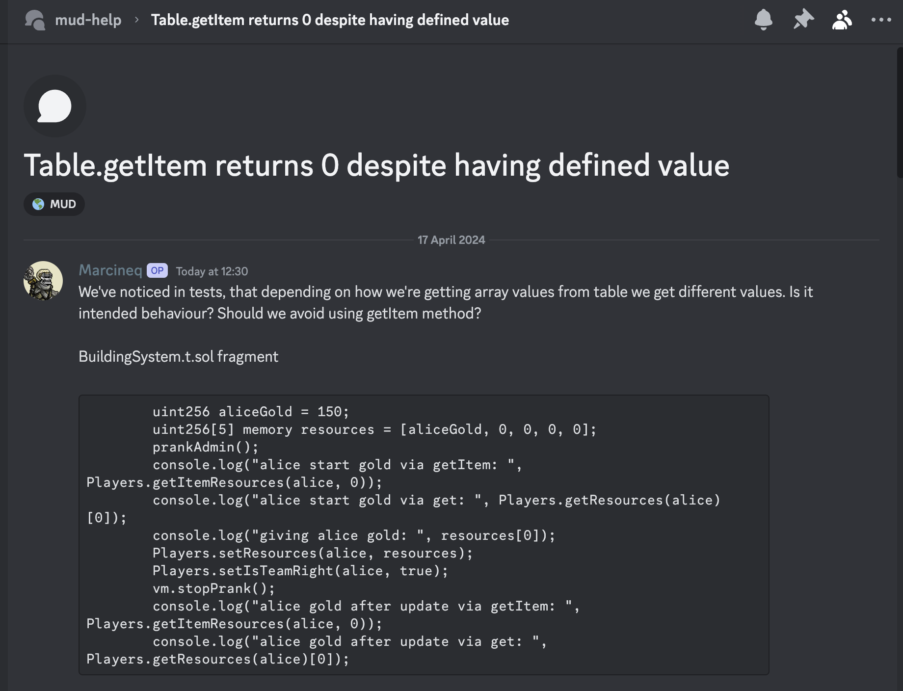

# StoreRead.getDynamicFieldLength bug

## Summary

Today (April 17th, 2024) we discovered a bug in [`StoreRead.getDynamicFieldLength`](https://github.com/latticexyz/mud/blob/main/packages/store/src/StoreRead.sol#L176-L189), that caused it to return invalid data for external reads to tables with both static and dynamic fields.

There is no known exploit/vulnerability related to this bug, but we recommend upgrading to `2.0.6` for the correct behaviour.

## Details

Previously [`StoreRead.getDynamicFieldLength`](https://github.com/latticexyz/mud/blob/main/packages/store/src/StoreRead.sol#L176-L189) incorrectly read from [`StoreCore.getFieldLength`](https://github.com/latticexyz/mud/blob/main/packages/store/src/StoreCore.sol#L850-L887), which expected a `fieldIndex` instead of a `dynamicFieldIndex`, and thereby returned an invalid result if the table had both static and dynamic fields (in which case `fieldIndex ≠ dynamicFieldIndex`).

For tables with no static fields, this function has the same behaviour as [`StoreCore.getDynamicFieldLength`](https://github.com/latticexyz/mud/blob/main/packages/store/src/StoreCore.sol#L889-L903) as the field and dynamic field indices are equal.

[`StoreRead`](https://github.com/latticexyz/mud/blob/main/packages/store/src/StoreRead.sol) is used for external reads from the `Store`/`World` contract, so this bug only materialized in external table reads (ie from `System`s outside the root namespace) of the dynamic length of a field in a table with both static and dynamic fields.

## Patch

The bug was fixed by changing `StoreRead.getDynamicFieldLength` to call `StoreCore.getDynamicFieldLength` instead of `StoreCore.getFieldLength`. The patch was released in [`@latticexyz/store@2.0.6`](https://www.npmjs.com/package/@latticexyz/store/v/2.0.6) and [`@latticexyz/world@2.0.6`](https://www.npmjs.com/package/@latticexyz/world/v/2.0.6). The protocol version was incremented to [`2.0.1`](https://github.com/latticexyz/mud/blob/main/packages/world/src/version.sol).

You can see the fix in [PR #2680](https://github.com/latticexyz/mud/pull/2680).

## How the bug was discovered

Marcineq from Minters raised that they were getting incorrect values from the `getItem` method for static arrays.

We found we could only replicate the issue with an end-to-end example project, using `MudTest` and the Typescript deployer. Conversely, tests in our internal testing setup, with Forge `Test` and `StoreMock`, returned all the correct values.

Upon further investigation, we found that `StoreSwitch.getDynamicFieldLength` was returning incorrect values for tables with both static and dynamic fields, causing the issue with `getItem`. Given that our internal tests used `StoreCore` directly with `StoreMock`, it was determined that `StoreRead` was the source of the issue.

Looking at `StoreRead.getDynamicFieldLength`, we found that it was incorrectly using `StoreCore.getFieldLength` instead of `StoreCore.getDynamicFieldLength`.
