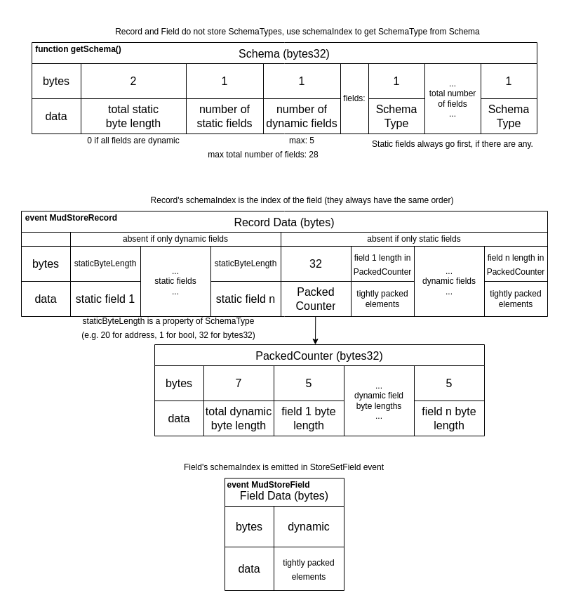

import { Aside } from "../../components/Aside";

**This spec is a work-in-progress**

## Standard events with enough information for Indexers to reconstruct the state

When a record or a single field is edited, or when a record is deleted, Store emits a standard event with enough information for off-chain actors to reconstruct the new version of the Store with event-sourcing.

```solidity
event StoreSetRecord(uint256 tableId, bytes32[] key, bytes data);
event StoreSetField(uint256 tableId, bytes32[] key, uint8 schemaIndex, bytes data);
event StoreDeleteRecord(uint256 tableId, bytes32[] key);
```

Each event includes the table ID and each key encoded as `bytes32`.

MUD comes with many libraries and services in order to reconstruct the state of any Store with typed columns and keys:

1. [Indexer](../indexer) is a service that mirrors the state of a Store in a database, and keeping it update to that with milliseconds of latency.
2. The MUD Networking stack can reconstruct the state of Store in the browser using either JSON-RPC or an Indexer.

### Data encoding

`bytes data` uses custom encoding, which MUD networking stack decodes.
Each event carries only data. To get a table's schema (information on how to decode it), use `IStore.getSchema(tableId)` or listen to `StoreSetRecord` updates of the schema table.

Schema is a way to dynamically store solidity types.
Use the [schema-type package](https://github.com/latticexyz/mud/tree/main/packages/schema-type) to work with it directly.
It's needed because `abi.decode` requires statically hardcoded types, and ABI encoding is very inefficient.

- `Schema` itself is a tightly packed list of types, like `uint256, bytes32, ...` in `abi.decode(data, (uint256, bytes32, ...))`, but the types aren't hardcoded.
- `Record` data is multiple `Fields` together, with `PackedCounter` to tell where arrays end/begin.
- `PackedCounter` contains lengths to tell arrays apart, packed tightly in 1 bytes32 word.
- `Field` data is very similar to solidity's `abi.encodePacked`, but for arrays it has no element padding (this is how solidity internally packs data for storage, but [it doesn't expose this tight packing in any way](https://github.com/ethereum/solidity/issues/8441))



<Aside emoji="ℹ️">
  This diagram represents data in events. In storage it's similar, but PackedCounter and each field all have separate
  slots (via hashed location, so not adjacent). And Schema comes from its own separate table, which is what
  `IStore.getSchema(tableId)` reads.
</Aside>
