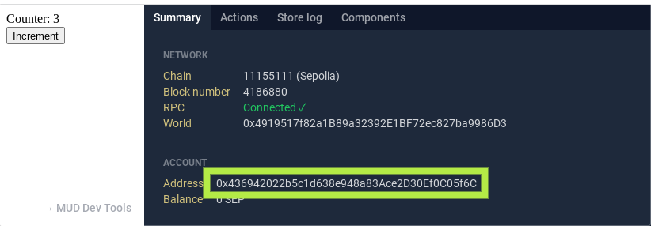

import { CollapseCode } from "../../../components/CollapseCode";

# Deploy to a blockchain

In this tutorial you deploy the application to a public blockchain, either the Lattice test blockchain or a general purpose one.

## Setup

1. [Create a new MUD application from the template](../minimal), but do not start it.

## Deploying to the Lattice test blockchain

## Deploying to a third party blockchain (Sepolia, Optimism Goerli, etc.)

Obtain these things for the blockchain you are using:

- URLs for both HTTP and WebSocket.
- Address (and the private key for it)
- ETH on that address.
  In the case of a test blockchain, there is usually a faucet you can use.

### Deploy the contracts

1. Edit the environment file for the contracts.

   ```sh filename="packages/contracts/.env"
   PRIVATE_KEY=<your private key>
   ```

1. Add a section to the Foundry configuration file:

   ```toml filename="packages/contracts/foundry.toml"
   [profile.mychain]
   eth_rpc_url = " <your URL goes here> "
   ```

1. Deploy the contracts.

   ```sh copy
   cd packages/contracts

   pnpm mud deploy --profile=mychain
   cd ../..
   ```

### Run the user interface

1. Edit the supported chains list to add the blockchain you use (unless it's the Lattice test network).
   To know what blockchain to import, [see the list of supported blockchains](https://github.com/wagmi-dev/viem/blob/main/src/chains/index.ts).
   If your network is not supported, [see the directions on creating a custom blockchain](https://viem.sh/docs/clients/chains.html#custom-chains).

   ```ts filename="packages/client/src/mud/supportedChains.ts" copy showLineNumbers {2,4-5,8}
   import { MUDChain, latticeTestnet, mudFoundry } from "@latticexyz/common/chains";
   import { <network> } from "viem/chains";

   <network>.rpcUrls.default.http = [ '<URL to access the blockchain through HTTP(S)>' ]
   <network>.rpcUrls.default.webSocket = [ '<URL to access the blockchain through WebSocket>' ]

   // If you are deploying to chains other than anvil or Lattice testnet, add them here
   export const supportedChains: MUDChain[] = [mudFoundry, latticeTestnet, sepolia];
   ```

1. Specify the chain ID for the blockchain you are using

   ```sh copy
   export VITE_CHAIN_ID=<chain ID for the blockchain you use>
   ```

   Note that you can also do this from the browser, by appending `?chainID=<chainID` to the user interface URL.

1. Run the user interface.

   ```sh copy
   cd packages/clients
   pnpm vite
   ```

1. Browse to the URL for the application.

### Use the user interface

You can already read information (the value of `Counter`, for example) with the user interface.
However, to issue transactions, for example to increment the counter, you need ETH.
There are two options here:

#### Application-managed address

This is the default setting for the template.
The application creates a private key, and uses that to interact with the blockchain.
The advantage is that as there is no wallet software, the user does not need to manually approve each transaction.
However, this means that the transactions are issued by a random account with no ETH.

To enable the use of a blockchain that does have gas costs, get the address of the account from the MUD dev tools and send it some testnet ETH.



#### Wallet-managed address

The other option is to replace the burner wallet by the user's own wallet, and accept that transactions will need to be signed.
This is the strategy used, for example, by [Words3](https://www.words3.xyz/).
To configure this, you need to edit the `setupNetworks.ts` file.

<CollapseCode>

```ts filename="packages/client/src/mud/setupNetwork.ts" showLineNumbers copy {10-11,32-37,84}
import { createPublicClient, fallback, webSocket, http, createWalletClient, Hex, parseEther, ClientConfig } from "viem";
import { createFaucetService } from "@latticexyz/services/faucet";
import { encodeEntity, syncToRecs } from "@latticexyz/store-sync/recs";
import { getNetworkConfig } from "./getNetworkConfig";
import { world } from "./world";
import { IWorld__factory } from "contracts/types/ethers-contracts/factories/IWorld__factory";
import { createBurnerAccount, createContract, transportObserver, ContractWrite } from "@latticexyz/common";
import { Subject, share } from "rxjs";
import mudConfig from "contracts/mud.config";
import { createWalletClient, custom } from 'viem';
import { <network> } from 'viem/chains'

export type SetupNetworkResult = Awaited<ReturnType<typeof setupNetwork>>;

export async function setupNetwork() {
  const networkConfig = await getNetworkConfig();

  const clientOptions = {
    chain: networkConfig.chain,
    transport: transportObserver(fallback([webSocket(), http()])),
    pollingInterval: 1000,
  } as const satisfies ClientConfig;

  const publicClient = createPublicClient(clientOptions);

  const burnerAccount = createBurnerAccount(networkConfig.privateKey as Hex);
  const burnerWalletClient = createWalletClient({
    ...clientOptions,
    account: burnerAccount,
  });

  const walletClient = createWalletClient({
        chain: <network>,
        transport: custom(window.ethereum)
  })
  const accounts = await walletClient.requestAddresses()
  walletClient.account = {address: accounts[0]}

  const write$ = new Subject<ContractWrite>();
  const worldContract = createContract({
    address: networkConfig.worldAddress as Hex,
    abi: IWorld__factory.abi,
    publicClient,
    walletClient,
    onWrite: (write) => write$.next(write),
  });


  const { components, latestBlock$, blockStorageOperations$, waitForTransaction } = await syncToRecs({
    world,
    config: mudConfig,
    address: networkConfig.worldAddress as Hex,
    publicClient,
    startBlock: BigInt(networkConfig.initialBlockNumber),
  });

  // Request drip from faucet
  if (networkConfig.faucetServiceUrl) {
    const address = burnerAccount.address;
    console.info("[Dev Faucet]: Player address -> ", address);

    const faucet = createFaucetService(networkConfig.faucetServiceUrl);

    const requestDrip = async () => {
      const balance = await publicClient.getBalance({ address });
      console.info(`[Dev Faucet]: Player balance -> ${balance}`);
      const lowBalance = balance < parseEther("1");
      if (lowBalance) {
        console.info("[Dev Faucet]: Balance is low, dripping funds to player");
        // Double drip
        await faucet.dripDev({ address });
        await faucet.dripDev({ address });
      }
    };

    requestDrip();
    // Request a drip every 20 seconds
    setInterval(requestDrip, 20000);
  }

  return {
    world,
    components,
    playerEntity: encodeEntity({ address: "address" }, { address: walletClient.account.address }),
    publicClient,
    walletClient,
    latestBlock$,
    blockStorageOperations$,
    waitForTransaction,
    worldContract,
    write$: write$.asObservable().pipe(share()),
  };
}
```

</CollapseCode>

<details>

<summary>Explanation of the changes</summary>

```ts
import { createWalletClient, custom } from 'viem';
import { <network> } from 'viem/chains'
```

Import [the Viem definitions necessary to use a wallet managed address](https://viem.sh/docs/clients/wallet.html#json-rpc-accounts).

```ts
  const walletClient = createWalletClient({
        chain: <network>,
        transport: custom(window.ethereum)
  })
```

Create the `walletClient` object.

```ts
const accounts = await walletClient.requestAddresses();
```

Wallets do not automatically give code on a web page access to the wallet information, not even addresses.
Instead, you need to [request access](https://viem.sh/docs/actions/wallet/requestAddresses.html), and the user needs to approve it.

```ts
walletClient.account = { address: accounts[0] };
```

Because user approval is required, `createWalletClient` does not write the address into the return value.
Therefore, we need to do it manually because MUD code expects the address to be in `walletClient.account.address`.

```ts
    playerEntity: encodeEntity({ address: "address" }, { address: walletClient.account.address }),
```

We need to return the address of `walletClient` we created, not of the burner wallet we ignore.

</details>
