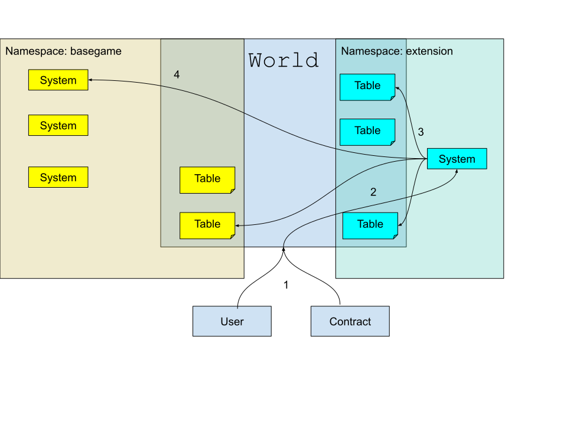

# Introduction

[`Store`](/store/introduction) provides low-level primitives for storage.
`World` provides the primitives for logic and access control on top of that storage.

Calls are sent to the `World` as a central entry point.
The `World` performs access control checks and if the request is authorized, sends it to the appropriate [`System`](/world/systems).
In most cases access from the `System` to [the tables that store the data](/world/tables) also goes through the `World`, making it impossible to bypass access control.
The `System` contracts themselves are stateless, all the data in managed by the `World`.

**Note:** A `System` in the root namespace _could_ bypass the access control.
However, only the owner of the root namespace (by default, the account that deployed the `World`) is able to deploy into the root namespace.

A `World` is like the [diamond design pattern](https://eips.ethereum.org/EIPS/eip-2535) in many ways.
The big difference is permissionless extensions.
Anybody can claim an unused [namespace](/world/namespaces-access-control), and put into it tables and `System` contracts to [extend the world](/guides/extending-world).

1. An account (either an [externally owned account](https://ethereum.org/en/developers/docs/accounts/#types-of-account) or a contract) sends a request to the `World`.
2. The `World` authorizes the request and sends it to the appropriate `System`.
3. The `System` can read information from all the `World`'s tables, and modify information in tables it has access to (by default those in its own namespace).
4. If the `System` needs to modify information inside a different namespace, it can call a `System` on that namespace to do so.
