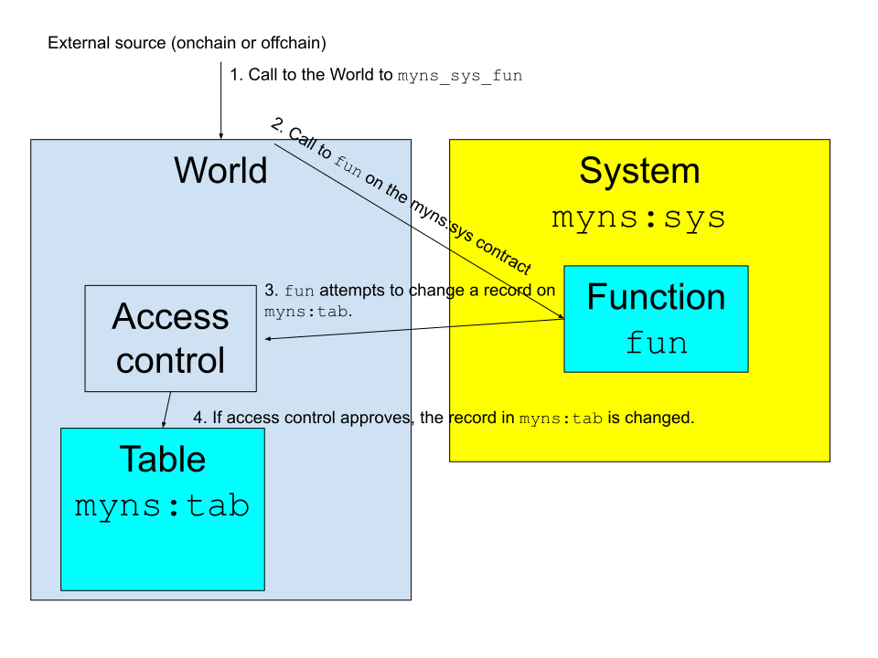

# Systems

One of the design principles of MUD is to separate the state of the `World` from the business logic that it implements.
We do this by having stateless `System` contracts with the functions that implement the business logic.
These contracts are called through the `World`, and call back on the `World` when they need to read or modify state information, which is stored in [tables](./tables).

Detailed illustration

1. An external entity (contract or externally owned account) calls on the `World` a function called `myns_sys_fun`.
   This means the `fun` function in the `sys` system, which is part of the `myns` namespace (the system is also refered to as `myns:sys`).

1. The `World` verifies that access is permitted (for example, because `myns:sys` is publicly accessible) and if so calls `fun` on the `myns:sys` contract with the provided parameters.

1. At some point in its execution `fun` decides to update the data in the table `myns:tab`.
   As with all other tables, this table is stored in the `World`'s storage.
   To modify it, `fun` calls a function on the `World` contract.

1. The `World` verifies that access is permitted (by default it would be, because `myns:sys` has access to the `myns` namespace).
   If so, it modifies the data in the `myns:tab` table.

The `World` serves as a central entry point and forwards calls to systems, which allows it to provide [access control](/world/namespaces-access-control).

## Calling systems

To call a `System`, you call the `World` in one of these ways:

- If a function is [registered](https://github.com/latticexyz/mud/blob/main/packages/world/src/modules/core/implementations/WorldRegistrationSystem.sol#L164-L201), you can call it using the syntax `world.namespace_system_function(parameters)`.
- You can use [`call`](https://github.com/latticexyz/mud/blob/main/packages/world/src/World.sol#L346-L351).
- If you have [the proper delegation](/world/account-delegation) you can use [`callFrom`](https://github.com/latticexyz/mud/blob/main/packages/world/src/World.sol#L353-L394).

## Writing systems

A `System` should _not_ have any state internally, but store all of it in tables in the `World`.
There are several reasons for this:

- It allows a `World` to enforce access controls.
- It allows the same `System` to be used by multiple `World` contracts.
- Upgrades are a lot simpler when all the state is centralized outside of the `System` contract.

Because calls to systems are proxied by the `World`, some message fields don't reflect the original call.
Use these substitutes:

| Normal code  | `System` replacement |
| ------------ | -------------------- |
| `msg.sender` | `_msgSender()`       |
| `msg.value`  | `_msgValue()`        |

When calling other contracts from a `System`, be aware that if you use `delegatecall` the called contract inherits the caller's permissions and can modify data from the `World` on behalf of the `System`.

### Calling one `System` from another

There are two ways to call one `System` from another one.

| Call type                                    | `call` to the `World`                                                                                                                           | `delegatecall` directly to the `System`                                                                                                                         |
| -------------------------------------------- | ----------------------------------------------------------------------------------------------------------------------------------------------- | --------------------------------------------------------------------------------------------------------------------------------------------------------------- |
| Permissions                                  | those of the called `System`                                                                                                                    | those of the calling `System`                                                                                                                                   |
| `_msgSender()`                               | calling `System` (unless you can use `callFrom`, which is only available when the user [delegates](/world/account-delegation) to your `System`) | can use [`WorldContextProvider`](https://github.com/latticexyz/mud/blob/main/packages/world/src/WorldContext.sol#L180-L203) to transfer the correct information |
| `_msgValue()`                                | zero                                                                                                                                            | can use [`WorldContextProvider`](https://github.com/latticexyz/mud/blob/main/packages/world/src/WorldContext.sol#L180-L203) to transfer the correct information |
| Can be used by systems in the root namespace | No (it's a security measure)                                                                                                                    | Yes                                                                                                                                                             |

## Registering systems

For a `System` to be callable from a `World` it has to be [registered](https://github.com/latticexyz/mud/blob/main/packages/world/src/modules/core/implementations/WorldRegistrationSystem.sol#L97-L201).
If the namespace in which the `System` is registered already exists, only the [namespace owner](/world/namespaces-access-control#ownership).
If it doesn't exist yet it is created, and the address that called `registerSystem` is assigned as the owner of the new namespace.

In a `World` there can only be one `System` per contract address.
If you need the functionality and there is already a `System` registered for that address, you can always deploy the bytecode as a new contract.

### Upgrading systems

The namespace owner can upgrade a `System`.
This is a two-step process: deploy the contract for the new `System` and then call `registerSystem` with the same `ResourceId` as the old one and the new contract address.

This upgrade process removes the old `System` contract's access to the namespace, and gives access to the new contract.
Any access granted _manually_ to the `System` is not revoked, nor granted to the upgraded `System`.

**Note:** You _should_ make sure to remove any such access.
`System` access is based on the contract address, so somebody else could register a namespace they'd own, register the old `System` contract as a system in their namespace, and then abuse those permissions (if the `System` has code that can be used for that, of course).

### Root systems vs non-root systems

- Root systems are systems registered in the root namespace (`bytes14(0)`)
- The difference between root systems and non-root systems is that root systems are `delegatecall`ed by the World, while non-root systems are `call`ed by the World.
- Since root systems are `delegatecall`ed, they can access the World's storage directly (via the internal `StoreCore` methods), instead of going through the external access controlled `IStore` methods
- This also means that root systems can modify all tables, independent of their access control settings
- The table libraries abstract this away, so that the same code can be used for root and non-root systems
- As with other namespaces, only the owner of the root namespace can register systems in the root namespace
- Because of this privilidged role, the root namespace should be used sparingly.

  ### Private systems

- Systems can be registered as private or public systems.
- If they are registered as public systems, no access control checks are performed and anyone can call them via the World
- If they are registered as private systems, the same access control checks are performed as for Tables (see access control)
