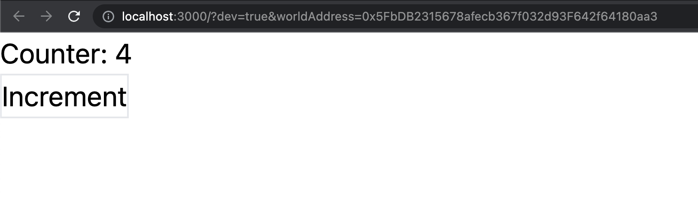
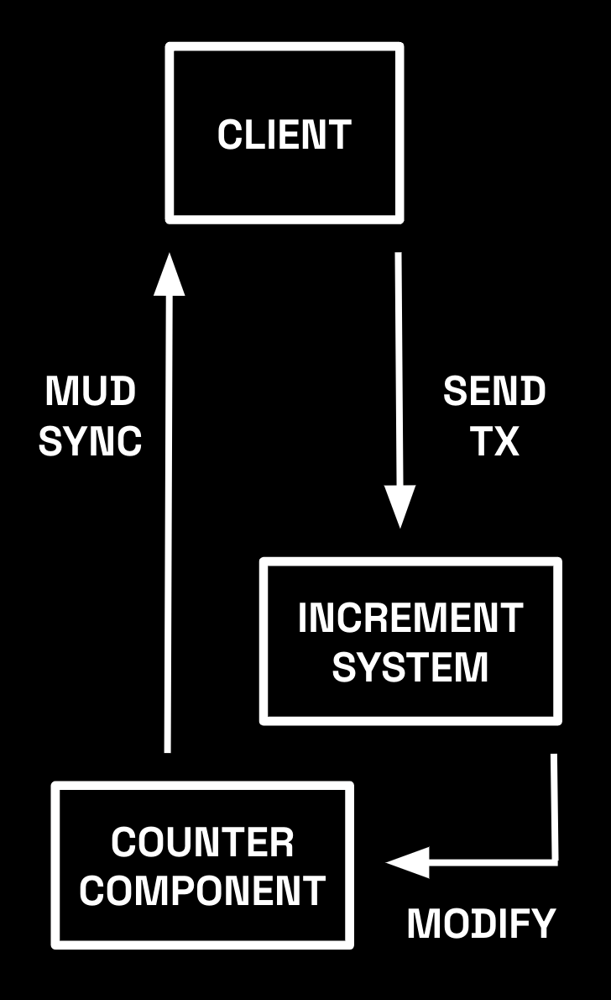

# 0. Set up MUD project

## Prerequisites

- git ([download](https://git-scm.com/downloads))
- foundry (forge, anvil, cast) ([download](https://book.getfoundry.sh/getting-started/installation), make sure to `foundryup` at least once)
- node.js (v16+) ([download](https://nodejs.org/en/download/))
- yarn (after installing node: `npm install yarn --global`)
- familiarity with React, TailwindCSS is helpful, but not required (you can still copy+paste)

## Get the starter kit

You’d usually start a new MUD project with the CLI using `npx create mud emojimon`, but for this tutorial, we’ve included some initial code to help you get going faster (base styles with TailwindCSS, for example).

Fork or clone the [Emojimon starter kit repo](https://github.com/latticexyz/emojimon):

```sh
git clone git@github.com:latticexyz/emojimon.git
```

Then jump into the repo and install dependencies:

```sh
cd emojimon
yarn
```

And then start up MUD's services (anvil node, contracts deployer, and client):

```sh
yarn dev
```


Once the contracts are compiled and deployed to the anvil node (a minute or two), a browser window should automatically open that will show the client app. You should see a “counter” without a value and a button to “increment” the counter.

## Send transactions

Press the button and watch the counter tick upward.



Each time you click the button, a transaction is sent to the `Counter` component contract on your local Ethereum node (anvil) and, once confirmed, the MUD networking layer detects the component value change and updates the client.

MUD abstacts away much of the complexity of building a blockchain app, executing transactions, and updating UIs. Magic, right? ✨

But wait, there's more!

## Contract hot-reloading

Let’s change the behavior and see what happens. Open `LibMath.sol` and change the increment function to add `2` instead of just `1`.

```diff LibMath.sol
 library LibMath {
   function increment(Uint32Component component, uint256 entity) internal {
     uint32 current = component.has(entity) ? component.getValue(entity) : 0;
-    component.set(entity, current + 1);
+    component.set(entity, current + 2);
   }
 }
```

After saving, the `dev:contracts` service will detect the contract change and redeploy all dependent contracts and update the client automatically. Once the client reloads, click the “increment” button and watch the counter value jump by 2 instead of 1. The live reloading of contracts will make it much quicker to iterate on our project.

<!-- TODO: figure out how to shrink this image and maybe float:right --->


